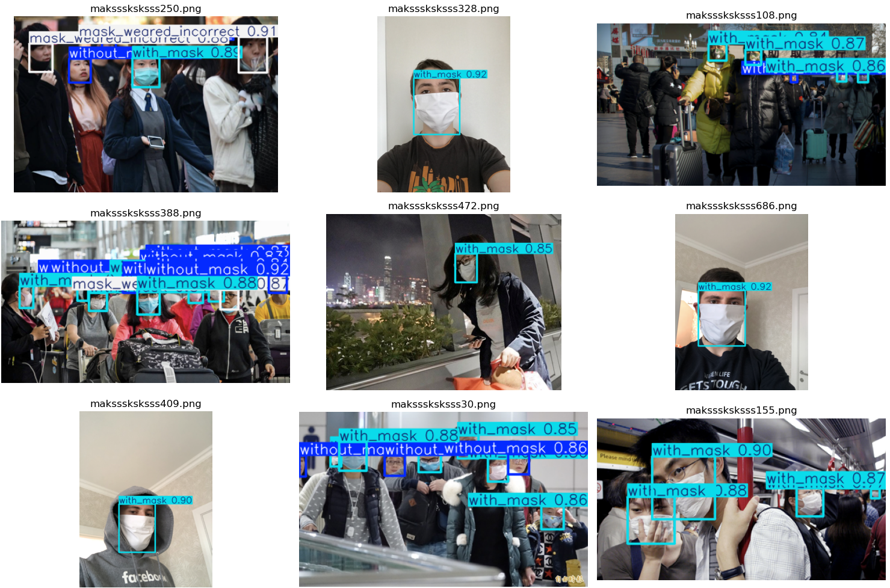
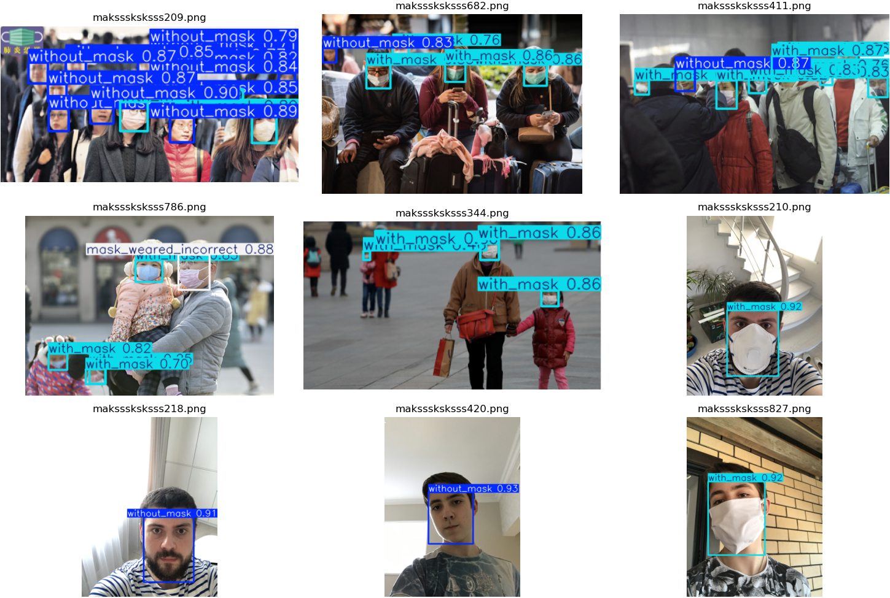
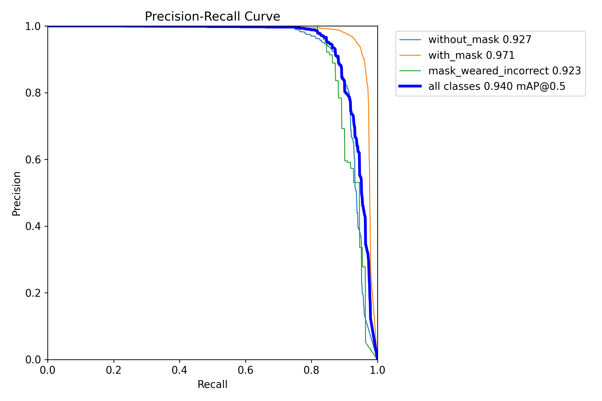
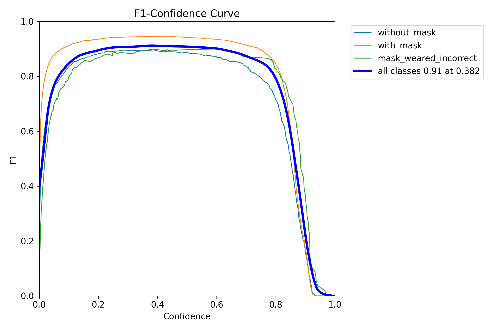
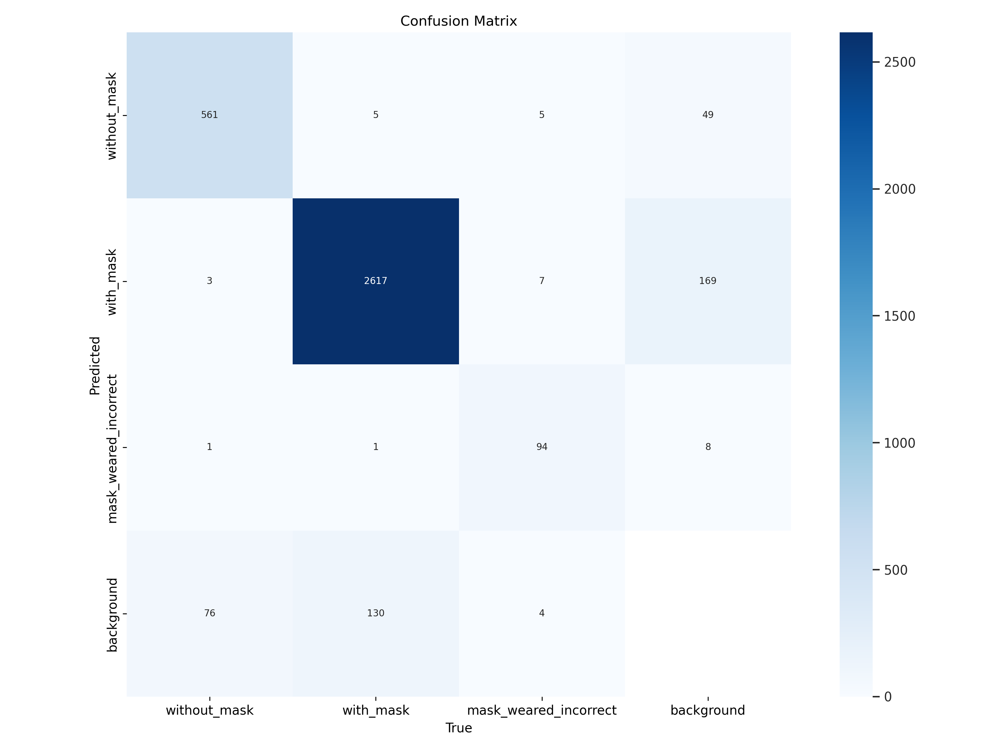

# :mask: Mask Object Detection Model using YOLOv11 👓

## 🟢 YOLOv11 Custom Training Walkthrough 🟢

This project demonstrates the power of custom training with the YOLOv11 model using a Kaggle dataset. Featuring a step-by-step walkthrough in a Jupyter Notebook, it provides tools to help you visualize datasets and results effortlessly. The trained model achieved impressive metrics, including an mAP@0.5 of 0.94, after 60 epochs on an RTX 2080 SUPER GPU, with a total training time of just 12 minutes.
Important points of this walktrough:
1. Imbalanced Dataset Solutions: Implemented custom functions to stratify and rebalance the data for optimal model performance.

2. Simplicity and Intuition: Integrated functions for easy visualization of datasets and inference results.

3. Model Sharing: Includes the trained model weights for immediate usage or further experimentation.

Dive into this comprehensive example to explore my results achieved with YOLOv11!
  
---

## ✨ **Highlight results**

### **Visual prediction of the model** 📸


> *Correct detection of the instances on sample images*
<br>
<br>


> *Precision and recall are high for all classes*
<br>
<br>


> *The model achieves a high F1 around a confidence threshold of ~0.38.*


### **Confusion Matrix** 📊

> *YOLO produces its own confusion matrix, which can be accesed easily* 
<br>
<br>

---

## 📖 **Project Walkthrough**


In this project, we will take you step-by-step through the process of creating this classifier using PyTorch, integrate TensorBoard and analize using Captum. Below is a summary of the key steps:

1. **Download and extract the dataset in your porject folder**:   
  - *Dataset is in Kaggle and easy to download*
    
2. **Visualization of initial data with their true labels**:  

  - *Plotting images with their bounding boxes to understand the dataset.*  

3. **Smple Exploratory Data Analysis (EDA)**:  

  - *Check the distribution of classes in the dataset.*  

4. **Stratification of the dataset to avoid unnecesary bias**:  

  - *Monitor loss,  accuracy, precision and recall in real time using TensorBoard. Save the logs for visualization at any moment.*  

5. **Training and validation cycle**:  

  - *Use Ultralytics framework to fine-tune a YOLO model.*.  

6. **Model inference**:  

  - *Visualizing predictions on a subset of the dataset.*  

---
## 📊 Dataset
This project uses the dataset of [Face Mask Detection](https://www.kaggle.com/datasets/andrewmvd/face-mask-detection) from Kaggle.

It is a curated dataset that contains 853 images belonging to the 3 classes, as well as their bounding boxes in the PASCAL VOC format.

The classes are:

    With mask;
    Without mask;
    Mask worn incorrectly.

Download it from the above link and extract in the root folder to work with the project (you can call it `dataset` for instance)

---

## 📂 **Project Structure**
The project is organized in a modular way imported in the main Jupyter Notebook to improve code readability and maintainability.
```markdown
mask-object-detection-yolo11/
├── assets/                        # Images for the README file
├── model_results/                 # Model results and weights available to be used
├── src/                           # Modular code used in the project
│   ├── data_handling.py  
│   ├── training.py
│   └── xml_to_yolo.py
├── test_images_GradCAM            # Images used in the main file as samples
├── README.md                      # Documentation of the project
├── requirements.txt               # Dependencies
└── 01_mask_detector_OD.ipynb      # Main notebook for the walktrough
```

## ✨ **Main features of the project**
- **Clear modularization**: The project is divided into logical sections for ease of use and understanding.
- **Easy training and real-time logging**: Using Ultralytics framework is possible to easily train, adjust and monitorize our training.
- **Great mean Average Precision)**: The model is able to classify the 3 classes with great accuracy.
- **Simple execution and results visualization**: The project can be followed step-by-step using the main jupyter notebook.

---

## 🛠️ **Libs, Frameworks and Technologies**
- **Python**: Main programming language.  

- **Jupyter Notebooks**: For workflow organization.  

- **YOLO Framework**: Framework for training the deep YOLO model. 

- **TensorBoard**: Tracking of experiments and metrics

- **OpenCV / PIL**: For image processing, manipulation.  

- **Matplotlib/Seaborn**: Results visualization.

---

## 📖 **How to follow the project Walktrough**

### **1. Clone the repository**
Clone the project in your local machine:
```bash
git clone https://github.com/tu-usuario/City-Scene-Classifier.git
```
### **2. Download the dataset**
The dataset required for this project is hosted in Kaggle. Follow these steps to download it:

1. Visit the dataset page on Kaggle: [Face Mask Detection](https://www.kaggle.com/datasets/andrewmvd/face-mask-detection)  

2. Download the `.zip` file of the dataset.  

3. Extract the contents into the dataset/ folder of the project. The structure should look like this:

City-Scene-Classifier/  

```markdown
├── dataset/.  
| ├─── annotations/  # Class and bounding box annotations
| │ ├─── image1.xml
| │ ├─── image2.xml
|
│ ├─── images/       # Images of the dataset
| │ ├─── image1.png
| │ ├─── image2.png

...
```
  

**Note:** If you decide to place the data in a different folder name than `dataset`, be sure to update the path to the data in the main file of your Jupyter Notebook **(01_mask_detector_OD.ipynb)**.

### **3. Install dependencies**
Make sure you have a virtual environment set up (optional, but recommended). Then install the required dependencies:
```bash
pip install -r requirements.txt
```
### **4. Follow the main Jupyter for an easy step-by-step explanation**
**01_mask_detector_OD.ipynb** is the main Jupyter Notebook of the project. Inside there is an easy step-by-step guidance to reproduce the project, train the model, use different models, change hyperparameters and so.  

### **5. During training and experimentation, use TensorBoard local webapp**
When the training is happening:
1. Open a new terminal in your IDE
2. Set the folder to the project folder
3. Execute the following code: `tensorboard --logdir=logs`
4. The terminal will create a local server and give you a link address like: `http://localhost:<your_port>/`
5. Open the link and you will see the GUI of TensorBoard where you can follow your metrics, prints and others.

You can always execute step 3 to see your results again at any moment.


## 🌟 **Contact**

-  **Email**: rebound-buddy-size@duck.com
-  **GitHub**: https://github.com/eduardo-lezama
